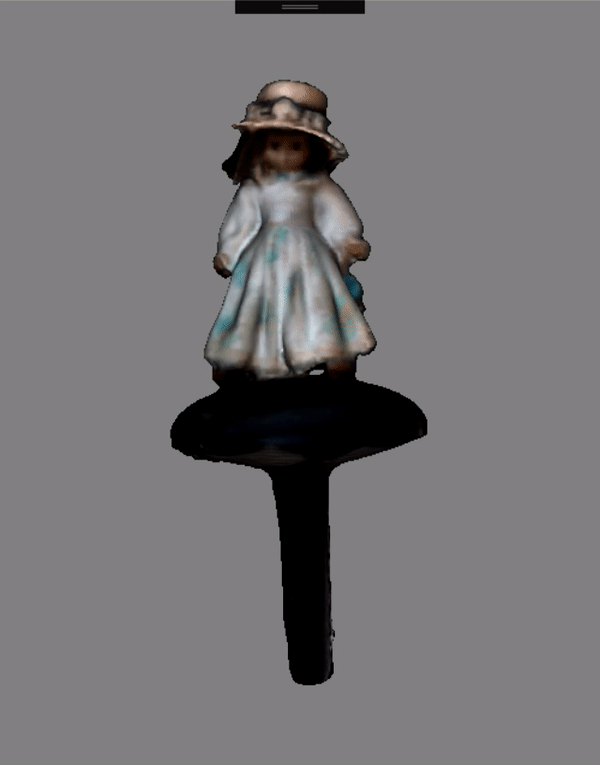

# UrhoCustomObj

Added the ability to load Wavefront OBJ in Xamarin Urho framework with colored vertices using a custom geometry loader.

Example model captured using custom reconstruction software and Intel Realsense D435
