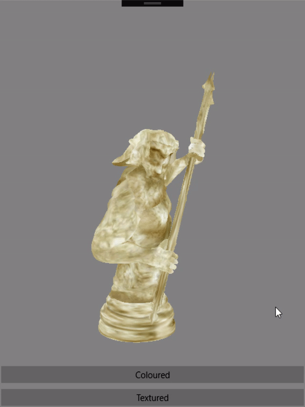

# UrhoCustomObj

Added the ability to load Wavefront OBJ in Xamarin Urho framework with colored vertices using a custom geometry loader.  Also added dynamic textured model loading.

### Coloured Vertices

### Textured Model

Example model captured using custom reconstruction software and Intel Realsense D435
